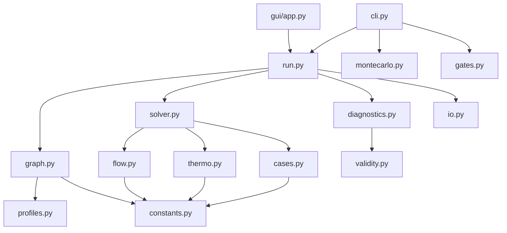

# Дерево инженерных решений и действий — `venting` v10.0.0

0D / сетевой решатель разгерметизации (lumped-parameter network depressurization solver).

**Назначение документа.** Показать объём и обоснованность методологии: что от чего зависит,
почему выбран каждый подход, чем это проверено и что дало. Каждый пункт прослеживается до
кода (`файл:функция`, строки). Формат связей: **РЕШЕНИЕ → потому что → проверено тем-то → дало результат**.

**Дисциплина достоверности.** Помечаю `[ДОПУЩЕНИЕ]` (модельный выбор, не проверяется в рантайме) vs
`[ПРОВЕРЕНО-В-КОДЕ]` (есть рантайм-проверка с порогом или тест). Где документация репозитория
(`CLAUDE.md`) расходится с кодом — это явно вынесено в §6, не «замазано».

Источник чисел: реальные прогоны 2026-06-22 (`.venv/bin/python -m venting ...`), `scc`, `grep`.

---

## 0. КАРТА «РЕШЕНИЕ → ПОЧЕМУ → ПРОВЕРКА → РЕЗУЛЬТАТ» (сводка)

| # | Решение | Почему | Проверено | Дало |
|---|---|---|---|---|
| 1 | 0D сосредоточенные параметры | таймскейл разгерметизации ≫ акустики; CFD избыточен | `validity._acoustic_flag`, порог ratio≥20 | дешёвая модель: ОДУ вместо CFD |
| 2 | Идеальный газ `P=mRT/V` | воздух при этих P,T близок к идеальному | применяется в `solver`, прямой флаг отсутствует | замкнутые формулы расхода |
| 3 | Решатель **Radau** (неявный, L-устойчивый) | система ЖЁСТКАЯ (быстрый `τ_min` vs длинный `duration`) | `solver.solve_case:490`; `max_step` из `τ_min` | большие шаги после спада транзиента |
| 4 | БЕЗ `jac_sparsity` | малое N; неверный паттерн вредит Radau | тест `test_jac_sparsity` ЗАПРЕЩАЕТ подсказку | плотный численный якобиан, корректно |
| 5 | Истечение: изэнтропика + запирание `r≤π_c` | сжимаемый поток при высоких ΔP | `flow.mdot_orifice_pos_props:35` | choked/subsonic ветви |
| 6 | Короткая труба: эффективный `Cd_eff` | дешевле и устойчивее полного Фанно | `flow.mdot_short_tube_pos`; диспетч `solver._mdot_short_edge` | трение+вход/выход в одном Cd |
| 7 | Термодинамика: 3 режима | компромисс цена/точность | `solver._property_model:64` | isothermal/intermediate/variable |
| 8 | Верификация по аналитике (gates) | привязать к замкнутым решениям | `gates.py` + `test_gates.py` пороги | errP≈7e-14, errMass≈4e-6 |
| 9 | Пик ΔП = `argmax|ΔP|`, режим в пике | важен пик, не среднее | `diagnostics.summarize_result:87` | per-edge max ΔP + регим в пике |
| 10 | UQ: Монте-Карло по Cd | Cd — главная неопределённость | `montecarlo.run_mc` | mean/std/p5/p50/p95 на ΔP |

---

## 1. ФИЗИЧЕСКАЯ ПОСТАНОВКА И ДОПУЩЕНИЯ

### 1.1. Какая система моделируется

0D / сосредоточенная сеть жёстких газовых объёмов (узлы) `GasNode(name, V, A_wall)`,
соединённых ограничителями потока (рёбра), дренирующая во внешнюю атмосферу, чьё давление
`P_ext(t)` падает во времени. Первичный выход — максимум `|ΔP|` на каждом ребре и режим
истечения (choked/subsonic). `[ПРОВЕРЕНО-В-КОДЕ: graph.py:9-66]`

Узлы/рёбра (все `@dataclass(frozen=True)`, `graph.py`):
- `GasNode(name, V, A_wall)` — жёсткая полость (строки 9-13).
- `OrificeEdge(a, b, A_total, Cd_model, label)` — острокромочное отверстие (31-37).
- `ShortTubeEdge(..., D, L, eps, K_in, K_out, ..., fanno=False)` — труба конечной длины
  с трением и местными потерями; флаг `fanno` включает модель Фанно (40-52).
- `SlotChannelEdge(a, b, w, delta, L)` — вязкая ламинарная щель (Пуазейль) (55-62).
- `EXT_NODE = -1` — внешняя граница (65).

**Топологии (две, не больше)** — `graph.build_branching_network:329-341`:
- `single_chain` (`_build_single_chain:149-237`): линейная цепочка
  `cell_N ↔ … ↔ cell1 ↔ vest ↔ (gap) ↔ ext`. Узел 0 = «вестибюль». `N_par` — число
  одинаковых ячеек, слитых в один узел (умножает объём, площадь стенки и площадь интерфейса,
  `_make_int_edge:129`). `use_gap` добавляет буферный узел через щелевое ребро.
- `two_chain_shared_vest` (`_build_two_chain_shared_vest:240-326`): две цепочки A и B
  длиной `N_chain` / `N_chain_b`, делящие общий вестибюль.

> Уточнение к ТЗ: `n_chain / n_par / vestibule` — это НЕ названия топологий, а поля конфигурации
> (`N_chain`, `N_par`, `V_vest`/`use_gap`), параметризующие цепочку. `[ПРОВЕРЕНО]`

### 1.2. Физические допущения — критерий, порог, где проверяется

| Допущение | Почему принято | Где/как проверяется | Критерий и ПОРОГ | Тип |
|---|---|---|---|---|
| **A. 0D / сосредоточенные параметры** (нет пространственных градиентов, акустики, ударных волн) | таймскейл блоудауна (секунды) ≫ акустический транзит; CFD избыточен и дороже | `validity._acoustic_flag:19-41`: `c=√(γ·R·T_mean)`, `t_ac=l_char/c`, `t_dyn=|P/dP/dt|`, `ratio=min(t_dyn)/t_ac` | `ratio ≥ 20.0` → ok, иначе warning (строка 33); `l_char=0.1 м` | ДОПУЩЕНИЕ + ПРОВЕРЕНО |
| **B. Идеальный газ** `P=mRT/V` | воздух при этих P,T близок к идеальному; даёт замкнутую формулу расхода | применяется `solver.build_rhs.p_from_mt:95`, `m0=P0·V/(R·T0):358` | **прямого флага нет** (Z не проверяется); косвенно — Кнудсен (D) | ДОПУЩЕНИЕ (без флага) |
| **C. Квазистационарный поток через рёбра** (расход — мгновенная алг. функция P,T; нет инерции потока) | время заполнения ребра ≪ время блоудауна полости | расходные функции — чистые алгебр. отображения (`flow.py`); в RHS нет состояния ребра | **прямого флага нет**; ближайшие — Mach короткой трубы (G) и ламинарность щели (E) | ДОПУЩЕНИЕ (без флага) |
| **D. Континуум / Кнудсен** | формулы расхода предполагают континуум; при низком P/малых отверстиях ломаются | `validity._knudsen_flag:243-305`: `mfp=k_B·T/(√2·π·D_mol²·p)`, `Kn=mfp/d_char` (субсэмпл каждый 10-й шаг) | `Kn<0.01` ok (континуум); `0.01≤Kn<0.1` warning (slip); **`Kn≥0.1` FAIL** (переходный/свободномолекулярный) (291-296) | ДОПУЩЕНИЕ + ПРОВЕРЕНО (может дать **fail**) |
| **E. Щель ламинарна (Пуазейль)** | узкие зазоры проектируются ламинарными; формула верна до перехода | `validity._slot_laminar_flag:62-100`: `u=δ²·ΔP/(12μL)`, `Re=ρ·u·d_h/μ` | `Re_max < 1000` → ok, иначе warning (95) | ДОПУЩЕНИЕ + ПРОВЕРЕНО |
| **F. Целостность состояния** (m≥0, T≥0, конечность) | численный дрейф мог бы дать отрицат./NaN | `validity._state_flag:308-331` | NaN/Inf или `m<−1e-12` или `T<0` → **FAIL**; `T<T_SAFE=1.0` → warning | ПРОВЕРЕНО (может дать **fail**) |
| **G. Квази-1D модель короткой трубы** (Mach/Re/трение) | конечная труба теряет на трении и входе/выходе; квази-1D дёшев при низком Mach | `validity._short_tube_flag:103-240`: `Mach=u/√(γRT)`, `Re`, `Cd_eff` | `M<0.3` ok; `0.3≤M<0.6` warning; `M≥0.6` warning (никогда не fail) (218-226) | ДОПУЩЕНИЕ + ПРОВЕРЕНО |
| **H. Диапазон фита NASA-7** (cp/cv/γ от T) | полином фитится на конечном диапазоне | `validity._thermo_range_flag:44-59` | `T∈[200, 1000] K` → ok, иначе warning | ДОПУЩЕНИЕ + ПРОВЕРЕНО |
| **I. Единицы внешнего P** (эвристика mmHg-как-Pa) | частая ошибка ввода | `validity.evaluate_validity_flags:354-359` | `200≤max(P_ext)≤2000` → warning | ПРОВЕРЕНО (эвристика, не физика) |

Агрегатор `validity.evaluate_validity_flags:334-360` возвращает все флаги. **Только
`state_integrity` и `knudsen_regime` могут дать `fail`**, остальные — ok/warning.

### 1.3. Физические константы (`constants.py`, полный список) `[ПРОВЕРЕНО]`

| Имя | Значение | Ед. | Смысл |
|---|---|---|---|
| `GAMMA` | 1.4 | – | показатель адиабаты воздуха |
| `R_GAS` | 287.05 | Дж/(кг·К) | газовая постоянная сухого воздуха |
| `C_V` | `R/(γ−1)`=717.625 | Дж/(кг·К) | теплоёмкость при V=const |
| `C_P` | `γ·C_V`=1004.675 | Дж/(кг·К) | теплоёмкость при P=const |
| `K_BOLTZMANN` | 1.380649e-23 | Дж/К | постоянная Больцмана (Кнудсен) |
| `D_MOL_AIR` | 3.65e-10 | м | эфф. диаметр молекулы (Jennings 1988) |
| `T0` | 300.0 | К | начальная температура |
| `P0` | 101325.0 | Па | начальное давление (1 атм) |
| `T_SAFE` | 1.0 | К | нижний пол T (защита знаменателя) |
| `M_SAFE` | 1e-18 | кг | нижний пол массы |
| `P_STOP` | 5.0 | Па | порог ранней остановки решателя |
| `PI_C` | `(2/(γ+1))^(γ/(γ−1))`≈0.5283 | – | **критическое отношение давлений (запирание)** |
| `C_CHOKED` | `√(γ·(2/(γ+1))^((γ+1)/(γ−1)))`≈0.6847 | – | коэффициент массового потока при запирании |

`EXT_NODE=-1` определён в `graph.py:65` (не в `constants.py`).

---

## 2. ЧИСЛЕННЫЕ РЕШЕНИЯ (РАЗВИЛКИ)

### 2.1. Решатель ОДУ — **Radau** `[ПРОВЕРЕНО: solver.py:490, 563]`

**РЕШЕНИЕ:** `scipy.integrate.solve_ivp(..., method="Radau", ...)` — неявный метод
Рунге–Кутты (Radau IIA, порядок 5, A-/L-устойчивый). Жёстко зашит строковым литералом
(не BDF, не переключатель).

```python
sol = solve_ivp(rhs, (0.0, case.duration), y0,
    method="Radau", t_eval=t_eval,
    rtol=1e-7 if case.thermo == "isothermal" else 1e-6,
    atol=1e-10 if case.thermo == "isothermal" else 1e-8,
    max_step=max_step, events=events)              # solver.py:486-496
```

**ПОТОМУ ЧТО система ЖЁСТКАЯ — и это видно из кода количественно.** `_prepare_solve:398-408`
строит самый быстрый таймскейл блоудауна:
```python
mdot_ch = Cd_max*A_max*C_CHOKED*P0/√(R_GAS·T0)
tau_min = (V_min·P0)/(R_GAS·T0·mdot_ch)
max_step = max(min(duration/2000, tau_min/10), 1e-4)   # solver.py:404-408
```
Разброс `V/A/Cd` по узлам сети даёт широкий спектр временных констант (`tau_min` ≪ `duration`) —
классическая сигнатура жёсткости. `[ПРОВЕРЕНО: конструкция `tau_min`; ДОПУЩЕНИЕ: сам ярлык
«жёсткая» в комментариях кода не назван — это стандартная теория ОДУ]`

**ОТВЕРГНУТАЯ АЛЬТЕРНАТИВА:** явный решатель (`RK45`, дефолт SciPy). Для жёсткой системы он
ограничен по устойчивости шагом `≲ τ_min` на всём горизонте → миллионы микрошагов на длинном
блоудауне. Неявный L-устойчивый Radau берёт большие шаги после спада быстрого транзиента.
`[ДОПУЩЕНИЕ: выбор в коде есть, обоснование «RK45 отвергнут» в комментарии не записано]`

**ДАЛО:** см. §3 — gates сходятся до errP≈7e-14; сеть из 20 узлов решается (`test_jac_sparsity:test_large_network_solves_with_radau`).

### 2.2. Якобиан — БЕЗ паттерна разреженности `[ПРОВЕРЕНО ОТРИЦАТЕЛЬНО + тест-ЗАПРЕТ]`

**РЕШЕНИЕ:** `solve_ivp` вызывается БЕЗ `jac` и БЕЗ `jac_sparsity` → Radau строит якобиан
плотными конечными разностями. `grep jac_sparsity src/venting/solver.py` = 0 совпадений.

**Это осознанное решение, а не пробел:** тест `tests/test_jac_sparsity.py::
test_solver_does_not_use_identity_only_jac_sparsity_hint` **АКТИВНО ЗАПРЕЩАЕТ** подсказку:
```python
assert "jac_sparsity" not in src
```
**ПОТОМУ ЧТО** для малых N (0D сеть) плотный численный якобиан дёшев, а неверная/identity-only
подсказка разреженности УХУДШИЛА бы Radau. `[ПРОВЕРЕНО]`

> ⚠️ `CLAUDE.md` дважды утверждает, что решатель «applies sparsity pattern for Radau Jacobian».
> Это **опровергается кодом и тестом**. См. §6.

### 2.3. Модель истечения — изэнтропика + запирание `[ПРОВЕРЕНО: flow.py:30-46]`

**РЕШЕНИЕ:** острокромочное отверстие `mdot_orifice_pos_props` — сжимаемое изэнтропическое
сопло с критерием запирания по отношению давлений `r = P_dn/P_up`:
```python
pi_c = (2/(γ+1))**(γ/(γ−1))                  # ≈0.5283
if r <= pi_c:                                # ЗАПЕРТО (choked)
    return Cd*A*P_up*c_choked/√(R·T_eff)     # flow.py:35-36
# иначе subsonic, bracket = r^(2/γ) − r^((γ+1)/γ)   :40-46
```
**ПОТОМУ ЧТО** при высоких ΔP (сброс в вакуум) поток реально запирается на скорости звука —
incompressible/Бернулли занизил бы расход. **ОТВЕРГНУТО:** несжимаемая модель Бернулли (нет
ветви запирания).

> Замечание о соглашении: ТЗ/`CLAUDE.md` пишут запирание как `P_up/P_down ≥ ...` с порогом 0.528.
> Код использует **обратное** отношение `P_dn/P_up ≤ π_c≈0.528`. Физика та же; авторитетна форма кода. `[ПРОВЕРЕНО]`

### 2.4. Канальные потери / псевдо-Cd `[ПРОВЕРЕНО: flow.py:82-131]`

**РЕШЕНИЕ:** короткая труба (дефолт v10) — «лоссы-сопло» через эффективный коэффициент
расхода. Итерация неподвижной точки (≤5 проходов): на каждом считается расход, скорость,
`Re`, число Дарси `f_D=friction_factor(Re, ε/D)`, и:
```python
K_tot = K_in + K_out + f_D·(L/D)
Cd_eff = 1/√(Cd0^(−2) + K_tot)              # сопротивления последовательно, flow.py:~125
```
Трение Дарси `friction_factor:67-79` — ламинар `64/Re` (Re<2000), турбулент Swamee–Jain
(Re>4000), линейный бленд в переходе 2000–4000. Вязкость — Сазерленд `mu_air_sutherland:6-11`
(`μ0=1.716e-5`, `S=111 К`).

**ПОТОМУ ЧТО** конечная труба теряет давление на трении и входе/выходе; алгебраический `Cd_eff`
дёшев и устойчив. **ОТВЕРГНУТО — полный Фанно как дефолт:** docstring явно
«does not model Fanno friction choking» (`flow.py:99-100`); Фанно требует вложенной бисекции
(60–80 итераций на ребро на шаг RHS) — дороже и менее устойчив. Развилка — булев флаг ребра:
```python
def _mdot_short_edge(edge, ...):
    if edge.fanno: return mdot_fanno_tube(...)   # только по явному opt-in
    return mdot_short_tube_pos(...)              # solver.py:27-61
```
Фанно реализован (`mdot_fanno_tube:283-324`, ссылка: Shapiro 1953, гл. 6) и ограничен снизу
оценкой лоссы-сопла (`min(md_f, md_l)`), но включается только при `edge.fanno=True`.
`[ПРОВЕРЕНО: ветвление; ДОПУЩЕНИЕ: стоимостное обоснование в коде не записано]`

### 2.5. Термодинамика — 3 режима `[ПРОВЕРЕНО: solver.py:64-83, 97, 163]`

**РЕШЕНИЕ:** строка `case.thermo` выбирает модель свойств `_property_model:64-83`:

| Режим | Что решается | Свойства | dT/dt? |
|---|---|---|---|
| `isothermal` | только масса `dm/dt=Σṁ`, `T≡T0` | — | НЕТ (`T=full(N,T0)`, solver:102) |
| `intermediate` | масса + энергия | **постоянные** `C_P, C_V, γ=1.4` | ДА (solver:276-282) |
| `variable` | масса + энергия | **NASA-7** `cp(T),cv(T),γ(T),h(T)` (200–1000 К) | ДА |

Энергетический баланс (не-изотерм., `solver.py:276-282`): `dT[i]=(dE[i]−u_i·dm[i])/(m_i·cv_i)`.
Стенка — ортогональный субрежим `wall_model∈{fixed, lumped}`; lumped добавляет N состояний
`T_wall` и ОДУ с конвекцией/радиацией/источником (solver:284-300).

**ПОТОМУ ЧТО** компромисс цена/точность: изотермический дёшев (только масса, `rtol=1e-7`);
постоянные cp достаточны при малых экскурсиях T; NASA-7 — когда T сильно гуляет.
**ОТВЕРГНУТО:** «всегда variable» как форс-дефолт (лишняя стоимость полинома, когда не нужен)
и «чисто адиабатический без стенки» (адиабата = предел `h_conv=0`, не отдельный режим).

> ⚠️ `CLAUDE.md` пишет диапазон NASA-7 «~200–2000 К». В коде `T_FIT_HIGH=1000.0`
> (`thermo.py:22`), клампинг на 1000 К. См. §6.

---

## 3. ВЕРИФИКАЦИЯ И КОНТРОЛЬ КАЧЕСТВА

### 3.1. Аналитические gates (`gates.py`) `[ПРОВЕРЕНО]`

**2 функции-гейта** (не 5 — см. §6): `gate_single` и `gate_two`, обе возвращают
`GateMetrics(errP, errT, errMass, errEnergy)`.

**Gate A — `gate_single:26` (одноузловой блоудаун в вакуум).** Сверяется с ЗАМКНУТЫМИ
адиабатическими решениями (`gates.py:33-37`):
- давление: `p_adi(t)=P0·(1+β·α·t)^(−2γ/(γ−1))`
- температура: `t_adi(t)=T0·(1+β·α·t)^(−2)`, где `α=Cd·A·C_CHOKED·√(R·T0)/V`, `β=(γ−1)/2`.
- `errMass`: остаток баланса массы `|(m_f+∫ṁ dt)−m0|/m0`.
- **Маскирование на пик/высокое-P:** `mask = P[0,:] > 0.01·P0` (gates.py:49-50) — нормы ошибки
  берутся только там, где давление узла > 1% от P0 (хвост у равновесия, где относит. ошибка
  взрывается, исключён). Это и есть проверка В ОБЛАСТИ ПИКА, а не в среднем.

**Gate B — `gate_two:74` (двухузловой: ячейка → вестибюль → выход).** Замкнутого решения P/T
нет (`errP=errT=0`); это **гейт сохранения**: полная масса (`errMass`) и полная энергия
(`errEnergy`, c_v-энергия внутрь, c_p-энтальпия наружу), `gates.py:88-105`.

`gates.py` сам **не содержит assert** — он считает метрики; пороги — в pytest (§3.2).

### 3.2. pytest-набор: 59 тестов в 15 файлах `[ПРОВЕРЕНО: 59 passed]`

«5 гейтов» из доков = **5 тест-функций в `test_gates.py`** (это и есть источник числа 5):

| Тест | Сверяется с | Порог |
|---|---|---|
| `test_single_node_analytic_match_adiabatic` | адиабатич. `p_adi/t_adi` (маска 1%) | `errP<5e-3`, `errT<5e-3` (0.5%) |
| `test_single_node_analytic_match_isothermal_limit` | `p_iso=P0·e^(−αt)` (wall-h=1e6) | `errP<5e-3` |
| `test_mass_conservation_single_node` | баланс массы | `err<1e-3` (0.1%) |
| `test_two_node_mass_conservation` | масса + энергия | `err<1e-3`, `err_e<1e-2` |
| `test_monotonic_pressure_when_vacuum` | монотонность спада | `max(diff P)≤1e-6·P0` |

Самый жёсткий — регрессионный `test_regression_cli_baseline.py`:
`errP<1e-6`, `errT<1e-6`, `errMass<1e-4`, `errEnergy<1e-4`.

Модели потока — `test_short_tube.py` (12 тестов): труба L→0 ≈ отверстие (`<2%`), монотонность
по длине/шероховатости/K-потерям, Фанно < лоссы-сопла, Фанно при L→0 ≈ отверстие (`<0.1%`),
предел запирания Mach. `test_validity_and_units.py`: пороги Кнудсена
(`Kn(101325)<0.01`, `Kn(1.0)≥0.1`, `0.01≤Kn(100)<0.1`), предупреждение mmHg-как-Pa.

**Реальные достигнутые ошибки (прогон `venting gate`):**
```
gate_single: errP=7.4e-14, errT=5.1e-15, errMass=4.0e-6
gate_two:    errMass=1.8e-6, errEnergy=3.3e-6
```
Запас до самого жёсткого порога: errP ~1e8×, errMass ~25–55×. **Полный набор: 59 passed.**

### 3.3. Проверки в момент ПИКА ΔP, а не среднего `[ПРОВЕРЕНО: diagnostics.py:87-131]`

Пик ΔP — это `argmax|ΔP|` по всей серии, не среднее:
```python
idx = int(np.argmax(np.abs(dp)))            # пик по времени, diagnostics.py:87
max_dP[label] = float(np.abs(dp[idx]))
```
Все пиковые диагностики берутся в этом единственном индексе `idx`: `P_up`, `P_dn`, режим.
Классификация режима — в пике: `regime = "CHOKED" if r_pk ≤ PI_C else "subsonic"`
(`diagnostics.py:104-119`). `τ_exit` — характерное время запертого опорожнения
(`compute_tau_exit:12-16`), и пишется `t_peak/τ_exit` — где в блоудауне случился пик.

**Нюанс (честно):** маска `P>0.01·P0` живёт в ГЕЙТ-сравнении (`gates.py:49`, `test_gates.py:40`),
а флаги `validity.py` считаются по ВСЕЙ траектории через экстремумы (worst-case: `min(t_dyn)`,
`Re_max`, `Mach_max`, `Kn_max`; Кнудсен субсэмплится каждый 10-й шаг). То есть флаги валидности
консервативны (ловят худший момент где угодно), а пиковые ΔP/режим — локализованы в пике.
`[ПРОВЕРЕНО: чтением обоих файлов]`

---

## 4. ПАРАМЕТРИЗАЦИЯ И ПЕРЕИСПОЛЬЗОВАНИЕ

### 4.1. Параметры пользователя (`cli._add_common_args:145-217`) `[ПРОВЕРЕНО]`

Общий блок (для `sweep/thermal/sweep2d/mc`):
- **Профиль P_ext:** `--profile {linear,step,barometric,table}`, `--rate-mmhg` (20),
  `--step-time`, `--profile-file`, `--profile-pressure-unit {Pa,mmHg}`,
  `--external-model {profile,dynamic_pump}`.
- **Термодинамика/стенка:** `--thermo {isothermal,intermediate,variable}` (дефолт isothermal),
  `--h`, `--wall-model {fixed,lumped}` + `--wall-C-per-area/-h-out/-T-inf/-emissivity/-T-sur/-q-flux`.
- **Решатель (время):** `--duration` (150), `--npts` (800). *Метод/толерансы Radau НЕ
  экспонированы — зашиты в `solver.py`.*
- **Топология:** `--topology`, `--n-chain-b` (10), `--n-int` (1), `--n-exit` (1).
- **Геометрия:** `--cd-int/--cd-exit` (0.62), `--int-model/--exit-model {orifice,short_tube,fanno}`,
  `--L-int-mm/--L-exit-mm`, местные потери `--K-in-*/--K-out-*`, шероховатость `--eps-*-um`
  (+ устаревшие глобальные алиасы `--K-in/--K-out/--eps-um`).
- **Внешний объём/насос:** `--V-ext`, `--T-ext`, `--pump-speed-m3s`, `--P-ult-Pa`, `--do-plots`.

Оси свёрток — по сабкомандам (`build_parser:234-256`): `sweep` → `--d-int/--d-exit`;
`thermal` → `--d`, `--h-list` («0,1,5,15»); `sweep2d` → `--d-int-list/--d-exit-list`;
`mc` → `--d-int/--d-exit`, `--cd-int-range` («0.5,0.7»), `--cd-exit-range`, `--n-samples` (100), `--seed`.

> Уточнение: `N_chain=10`, `N_par=2` и геометрия панели (объёмы/площади из
> `get_default_panel_preset_v9`) **захардкожены**, не из CLI; пользователь управляет длиной
> второй цепочки, флагом топологии и числом отверстий. `[ПРОВЕРЕНО: cli.py:49-50, 287]`

### 4.2. Профили внешнего давления (`profiles.py`) `[ПРОВЕРЕНО]`

| Профиль | `P_ext(t)` | Функция |
|---|---|---|
| linear | `max(P0 − rate·t, 0)`, rate=mmHg/s·133.322 | `make_profile_linear:30-37` |
| step | `P0` при `t<step_time`, иначе 0 | `make_profile_step:40-44` |
| barometric | `max(P0·e^(−t/τ), p_floor=10)`, τ из нач. наклона | `make_profile_exponential:47-65` |
| table | лин. интерполяция CSV `(t,P)`, клампинг по краям; mmHg→Pa | `make_profile_from_table:68-106` |

`--external-model dynamic_pump` подменяет профиль ступенькой к 1e9 (P_ext отдаётся модели насоса).

### 4.3. Режимы прогона (сабкоманды, `cli.main:260-361`) `[ПРОВЕРЕНО]`

| Команда | Что делает | Артефакты |
|---|---|---|
| `gate [--single/--two]` | аналитические гейты (самопроверка решателя) | stdout |
| `gui` | десктоп PySide6/pyqtgraph (ленивый импорт) | окно |
| `compare A B [--output]` | дифф двух прогонов по per-edge метрикам | таблица + CSV |
| `sweep --d-int --d-exit` | **один** прогон в одной точке (см. §6 — не цикл) | полный набор |
| `sweep2d --d-int-list --d-exit-list` | 2D-сетка диаметр_вн × диаметр_вых | по набору на точку |
| `thermal --d --h-list` | чувствительность по конвекции стенки `h` | по набору на h |
| `mc ...` | UQ по Cd (§4.4) | mc_results.csv, mc_summary.json |

### 4.4. Оценка неопределённости — Монте-Карло (`montecarlo.run_mc:16-54`) `[ПРОВЕРЕНО]`

**РЕШЕНИЕ:** перебор по двум коэффициентам расхода `Cd_int`, `Cd_exit`, каждый — независимая
**равномерная** выборка из CLI-диапазона; на каждой выборке пересобирается сеть и решается:
```python
rng = np.random.default_rng(seed)
cd_int  = rng.uniform(*cd_int_range)         # montecarlo.py:31-32
cd_exit = rng.uniform(*cd_exit_range)
... solve_case ...; запись per-edge max_dP
```
Статистика на ребро (`montecarlo.py:43-54`): **mean, std (ddof=0), p5, p50, p95** от `max_dP`.
p5/p95 дают эмпирический 90%-интервал на пик ΔP.

**ПОТОМУ ЧТО** Cd — главный источник неопределённости (`CLAUDE.md` Known Limitations: «C_d is
the primary uncertainty; always run a Cd sweep»). Выход: `mc_results.csv` (строка на выборку) +
`mc_summary.json` (статистики).

> ⚠️ Доки/docstring называют это «Latin-hypercube». В коде — **независимая равномерная** выборка
> (`np.random.default_rng().uniform`), без LHS-стратификации / `scipy.stats.qmc`. См. §6.

### 4.5. Артефакты вывода (`io.py` + `run.export_case_artifacts:28-53`) `[ПРОВЕРЕНО]`

`results/{UTC_ГГГГММДД_ЧЧММСС}_{case}/`:
- `run.json` — воспроизводимость: `timestamp_utc`, `git_commit` (`git rev-parse HEAD`),
  `python_version`, `package_version`, `platform`, все параметры, solver_settings.
- `summary.csv` — per-edge: `edge, max_abs_dP_Pa, t_peak_s, r_peak, regime, peak_type, tau_exit_s`.
- `{stem}.npz` — временные ряды `t, m, T, P, P_ext, tau_exit` (сжато).
- `{stem}_meta.json` — пиковые диагностики + конфиг + флаги валидности.
- `{stem}_validity.json` — физические флаги (акустика, Re, Mach, фит-диапазон, Кнудсен).

---

## 5. КАРТА МОДУЛЕЙ

### 5.1. Назначение ключевых модулей `[ПРОВЕРЕНО]`

| Модуль | Назначение |
|---|---|
| `constants.py` | физические константы (лист, in-degree 8) |
| `geometry.py` | пересчёт единиц/площадей (лист) |
| `cases.py` | конфиги-датаклассы `CaseConfig/NetworkConfig/SolveResult` |
| `profiles.py` | профили внешнего давления `P_ext(t)` |
| `graph.py` | модель узлов/рёбер + `build_branching_network` |
| `flow.py` | газодинамическое ядро: расходы (orifice/slot/short-tube/Fanno), вязкость, трение |
| `thermo.py` | свойства воздуха NASA-7 (200–1000 К) |
| `solver.py` | ядро интегрирования (`solve_ivp` Radau): RHS, события, streaming |
| `diagnostics.py` | пост-обработка: `summarize_result`, `compute_tau_exit`, пики |
| `validity.py` | физические флаги (Кнудсен/акустика/Re/Mach/фит) |
| `gates.py` | аналитические гейты `gate_single/gate_two` |
| `montecarlo.py` | UQ по Cd: `run_mc`, `write_mc_outputs` |
| `io.py`, `run.py` | персистентность артефактов и единичный пайплайн прогона |
| `cli.py` | argparse-фронт / оркестратор (out-degree 9) |
| `gui/app.py` | десктоп-окно (ленивый импорт PySide6, out-degree 8) |

### 5.2. Граф зависимостей (X → Y: X импортирует Y) `[ПРОВЕРЕНО grep]`

```
cli         → cases, compare, constants, gates, montecarlo, plotting, presets, profiles, run
run         → cases, diagnostics, graph, io, profiles, solver
montecarlo  → cases, diagnostics, graph, profiles, solver
gates       → cases, constants, diagnostics, flow, geometry, graph, profiles, solver
solver      → cases, constants, flow, graph, thermo
diagnostics → cases, constants, graph, validity
validity    → constants, flow, graph, thermo
graph       → cases, constants, geometry, profiles
cases/flow/thermo → constants ;  presets → geometry
gui/app     → diagnostics, graph, presets, profiles, run, solver, gui/config, gui/state_layout
```
Основной поток данных: **cases/graph → solver → diagnostics/validity → io**, где `flow.py` и
`thermo.py` — зависимости решателя; `cli.py`/`gui/app.py` оркестрируют; `constants.py`/
`geometry.py` — листовые утилиты. Самый зависимый модуль — `constants` (in-degree 8).



### 5.3. Объём (измерено) `[ПРОВЕРЕНО]`

| Метрика | Значение | Источник |
|---|---|---|
| SLOC продакшн (`src/venting`, non-blank/non-comment) | **3 641** | grep |
| SLOC тесты (`tests/`) | **812** | grep |
| Исходных модулей (`src` + `gui`) | 26 | ls |
| Тест-файлов | 15 | ls |
| Тест-функций (`def test_`) | **59** | grep |
| Функций в `solver.py` (`def`) | 15 (7 модульного уровня + 8 вложенных) | grep |
| Функций в `flow.py` (`def`) | 13 (12 + 1 вложенная) | grep |
| Крупнейшие модули | `gui/app.py` 665, `solver.py` 581, `cli.py` 337, `validity.py` 329, `flow.py` 311, `graph.py` 298 | grep |

`scc src/venting tests` (verbatim): 41 файла Python, **4 419 строк кода**, сложность 569;
COCOMO-organic ориентир: $128 583, 6.31 мес, 1.81 чел. *(COCOMO калиброван не на Python —
ориентир, склонен завышать.)*

---

## 6. РАСХОЖДЕНИЯ КОД ↔ ДОКУМЕНТАЦИЯ (честный реестр)

Найдено при сверке (важно для защитимости — методология включает критическую проверку
собственных доков):

| # | Утверждение `CLAUDE.md`/ТЗ | Факт в коде | Ссылка |
|---|---|---|---|
| 1 | «applies sparsity pattern for Radau Jacobian» | **sparsity НЕТ**; тест `test_jac_sparsity` запрещает `jac_sparsity`; якобиан плотный численный | `solver.py:486-496`, `tests/test_jac_sparsity.py` |
| 2 | NASA-7 «~200–2000 К» | диапазон **200–1000 К**, клампинг на 1000 | `thermo.py:21-22` |
| 3 | запирание `P_up/P_down ≥ ((γ+1)/2)^…` | код: обратное `P_dn/P_up ≤ (2/(γ+1))^… ≈0.528` (та же физика) | `flow.py:30-36` |
| 4 | Монте-Карло = «Latin-hypercube» | **независимая равномерная** выборка, без LHS | `montecarlo.py:31-32` |
| 5 | `sweep` = «1D parameter sweep» | **один** прогон (не цикл); итерируют только `sweep2d`/`thermal` | `cli.py:348-350` |
| 6 | сабкоманда `montecarlo` | реальная команда — `mc` | `cli.py:248` |
| 7 | «5 analytical gate tests» | **2** функции-гейта в `gates.py`; 5 = число pytest-функций в `test_gates.py` | `gates.py`, `tests/test_gates.py` |

Ни одно расхождение не является дефектом физики — это терминологические/документационные неточности;
код в каждом случае самосогласован и покрыт тестами.

---

## Приложение: воспроизводимость

```bash
cd /Users/vladimir/Projects/venting
.venv/bin/python -m venting gate            # errP≈7e-14, errMass≈4e-6
.venv/bin/python -m pytest -q               # 59 passed
scc src/venting tests                       # 4419 code, COCOMO ориентир
grep -nE 'method=|jac_sparsity' src/venting/solver.py   # Radau, без sparsity
```

Каждое число прослеживается до файла/функции; помечено допущение vs проверенный-в-коде факт.
